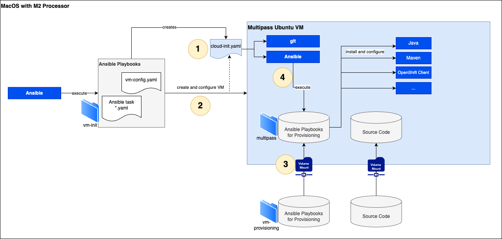

# multipass-java-integration-dev
A java based development environment using multipass.io running on a MacOS M2 system.



It contains the following tools

- Java 17 
- Maven
- OpenShift Client

## Setup

### Prerequisites

In order to install and use the development environment, the following requirements must be met.

- Install and configure [Multipass](https://multipass.run/). It is possible to use [Brew](https://brew.sh/) to install Multipass on MacOS. Follow the steps described in the [documentation](https://multipass.run/docs/installing-on-macos).

- Install and configure [Ansible](https://www.ansible.com/)


### Create VM

1. Prepare VM configuration

The configuration settings are made in the file ```<project-root>/vm-init/vm-config.yaml```. All settings are explained in this file.


2. In order to setup a new multipass VM navigate to ```<project-root>/vm-init``` folder and run the following command:

```bash
ansible-playbook create-vm-playbook.xml
```

3. Exceute Ansible script for provisioning inside VM. See below for further details.


### Update VM

If an adjustment of the VM configuration is required, then the following steps must be performed.

1. Prepare VM configuration

Change the settings in the file ```<project-root>/vm-init/vm-config.yaml```. All settings are explained in this file.


2. Navigate to ```<project-root>/vm-init``` folder and run the following command:

```bash
ansible-playbook update-vm-playbook.xml
```

**Note:** The VM will be automatically stopped and started again, when running this command!


### Provisioning

Provisioning of tools for development is also controlled via Ansible. The Ansible roles to be executed can be changed under afterwards. The following steps are required to execute the provisioning:

1. Modify Ansible roles in folder ```<project-root>/vm-provisioning```

2. Connect to the VM via SSH

```bash
ssh <vmuser>@IP-Address
``` 

**Notes:**  
- vmuser is configured in ```<project-root>/vm-init/vm-config.yaml```.
- IP-Address can be obtain using ```multipass info <vmname>``` or ```multipass list```.

3. Navigate to ```/provisioning/vm-provisioning```

4. Exceute the following command:

```bash
ansible-playbook provision-playbook.xml
```

## Insights

The creation of a VM is done in 4 steps. Basically the steps can be influenced by configuration settings in the file ```<project-root>/vm-init/vm-config.yaml```. The creation is controlled by Ansible.

In step 1 a cloud-init.yaml is created. The file contains the user and public keys and defines basic software that should be installed automatically when the VM is created.

In step 2, the VM is created and configured with Multipass.io.

In step 3, different mounts are defined in Multipass.io to exchange data between the VM and the host.

As the 4th and last step, an Ansible script can be executed within the VM to install further tools and to adapt the VM to one's own needs. The "Provisioning" script can be executed again at any time. Steps 1 - 3 are actually only for creating the VM.


